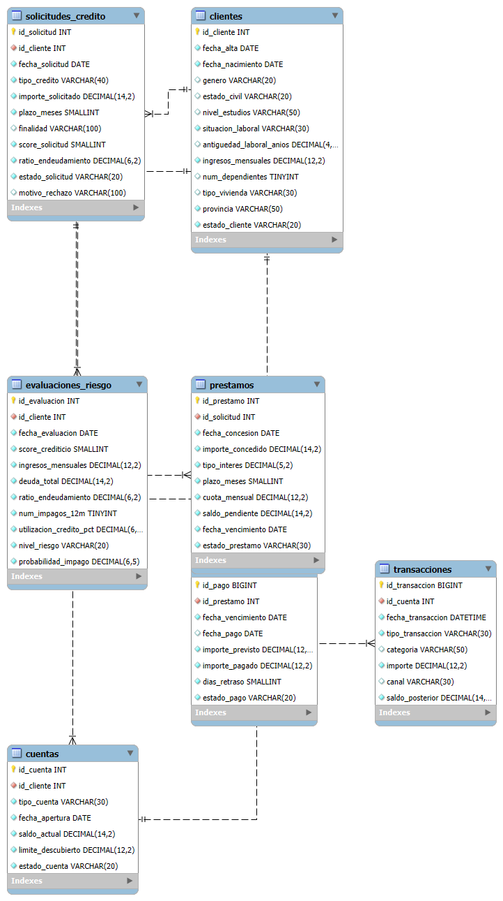

# Banking Customer & Credit Risk Analytics — MySQL

Proyecto de análisis de datos bancarios desarrollado principalmente en **MySQL**, orientado al estudio del comportamiento financiero de clientes, la concesión de crédito y el riesgo de impago.

El objetivo del proyecto es demostrar el uso de SQL aplicado a un caso de negocio realista, cubriendo desde el diseño de una base de datos relacional hasta técnicas avanzadas de análisis como CTEs, funciones de ventana, análisis temporal, segmentación de riesgo y creación de vistas analíticas.

---

## Objetivos del proyecto

Los principales objetivos son:

- Diseñar una base de datos relacional para representar información bancaria.
- Analizar las características financieras de los clientes.
- Estudiar el comportamiento de cuentas y transacciones.
- Analizar el proceso de solicitud y concesión de créditos.
- Identificar factores asociados a mora e impago.
- Analizar la evolución temporal del riesgo crediticio.
- Detectar posibles señales tempranas de deterioro financiero.
- Analizar la exposición crediticia de la cartera.
- Construir indicadores y rankings de riesgo.
- Crear una capa de vistas reutilizables para reporting y análisis.

---

## Tecnologías utilizadas

- MySQL 8
- MySQL Workbench
- SQL
- Python
- Git
- GitHub

Python se utiliza únicamente para generar los datos sintéticos. Todo el análisis principal del proyecto se realiza mediante SQL.

---

## Dataset

El proyecto utiliza un conjunto de datos bancarios sintéticos generado específicamente para este análisis.

El dataset contiene **375.569 registros** distribuidos entre siete tablas relacionadas.

| Tabla | Registros |
|---|---:|
| `clientes` | 5.000 |
| `cuentas` | 6.614 |
| `transacciones` | 288.942 |
| `solicitudes_credito` | 3.839 |
| `prestamos` | 3.027 |
| `pagos_prestamo` | 49.086 |
| `evaluaciones_riesgo` | 19.061 |

Los datos son completamente sintéticos y no contienen información personal ni bancaria real.

---

## Modelo de datos

La base de datos está formada por siete tablas principales.

| Tabla | Descripción |
|---|---|
| `clientes` | Información demográfica, laboral y económica de los clientes |
| `cuentas` | Cuentas bancarias asociadas a cada cliente |
| `transacciones` | Movimientos financieros realizados sobre las cuentas |
| `solicitudes_credito` | Solicitudes de financiación realizadas por los clientes |
| `prestamos` | Créditos finalmente concedidos |
| `pagos_prestamo` | Histórico de cuotas, retrasos e impagos |
| `evaluaciones_riesgo` | Evolución temporal del riesgo crediticio de los clientes |

### Diagrama relacional



Las principales relaciones son:

- Un cliente puede disponer de varias cuentas.
- Una cuenta puede registrar múltiples transacciones.
- Un cliente puede realizar varias solicitudes de crédito.
- Una solicitud aprobada puede generar un préstamo.
- Un préstamo puede tener múltiples cuotas.
- Un cliente puede disponer de varias evaluaciones de riesgo a lo largo del tiempo.

---

## Estructura del repositorio

```text
banking-credit-risk-sql/
│
├── README.md
│
├── sql/
│   ├── 00_creacion_base_datos.sql
│   ├── 01_clientes.sql
│   ├── 02_cuentas_transacciones.sql
│   ├── 03_creditos.sql
│   ├── 04_impagos_riesgo.sql
│   ├── 05_ctes_subconsultas.sql
│   ├── 06_funciones_ventana.sql
│   ├── 07_analisis_avanzado.sql
│   ├── 08_vistas_kpis.sql
│   └── 09_resultados_finales.sql
│
├── data/
│   ├── clientes.csv
│   ├── cuentas.csv
│   ├── solicitudes_credito.csv
│   ├── prestamos.csv
│   ├── pagos_prestamo.csv
│   └── evaluaciones_riesgo.csv
│
├── scripts/
│   └── generar_datos.py
│
└── docs/
    ├── modelo_relacional.png
    ├── diccionario_datos.md
    └── conclusiones.md
```

La tabla `transacciones`, debido a su mayor tamaño, puede generarse mediante el script incluido en `/scripts`.

---

## Estructura del análisis

### 01 — Clientes

Análisis descriptivo de la cartera:

- distribución de clientes;
- edad;
- situación laboral;
- ingresos;
- vivienda;
- segmentación económica.

### 02 — Cuentas y transacciones

Análisis del comportamiento financiero:

- saldos;
- número de cuentas;
- ingresos y gastos;
- categorías de gasto;
- flujo neto;
- utilización de canales;
- cuentas en descubierto.

### 03 — Créditos

Análisis del proceso de financiación:

- solicitudes de crédito;
- tasas de aprobación;
- motivos de rechazo;
- score crediticio;
- endeudamiento;
- tipos de crédito;
- tipos de interés;
- exposición crediticia.

### 04 — Impagos y riesgo

Análisis del comportamiento de pago:

- retrasos;
- mora;
- impagos;
- tasa de default;
- relación entre score e impago;
- riesgo actual;
- exposición por nivel de riesgo.

### 05 — CTEs y subconsultas

Reestructuración de análisis complejos mediante:

- Common Table Expressions;
- subconsultas;
- `EXISTS`;
- `NOT EXISTS`;
- múltiples CTEs encadenadas.

### 06 — Funciones de ventana

Uso de técnicas SQL avanzadas:

- `ROW_NUMBER()`;
- `RANK()`;
- `DENSE_RANK()`;
- `LAG()`;
- acumulados;
- medias móviles;
- rankings dentro de segmentos;
- evolución temporal del score;
- concentración de exposición.

### 07 — Análisis avanzado

Integración de diferentes fuentes de información para:

- detectar deterioro financiero;
- analizar cambios en el nivel de riesgo;
- detectar clientes que entran en riesgo alto;
- construir alertas tempranas;
- analizar comportamiento previo al impago;
- crear quintiles de riesgo;
- priorizar clientes para seguimiento.

### 08 — Vistas y KPIs

Construcción de una capa analítica reutilizable mediante:

- vistas intermedias;
- KPIs de cartera;
- KPIs de riesgo;
- Customer 360;
- watchlist de clientes;
- alertas tempranas.

### 09 — Resultados finales

Consolidación de KPIs y métricas finales para documentar los resultados del proyecto.

---

## Técnicas SQL utilizadas

### Fundamentos

- `SELECT`
- `WHERE`
- `ORDER BY`
- `GROUP BY`
- `HAVING`
- `CASE WHEN`

### Agregaciones

- `COUNT()`
- `SUM()`
- `AVG()`
- `MIN()`
- `MAX()`

### Modelo relacional

- `INNER JOIN`
- `LEFT JOIN`
- `CROSS JOIN`
- Primary Keys
- Foreign Keys
- restricciones `CHECK`
- índices

### SQL intermedio

- subconsultas;
- subconsultas correlacionadas;
- `EXISTS`;
- `NOT EXISTS`;
- agregación condicional;
- CTEs mediante `WITH`.

### SQL avanzado

- `ROW_NUMBER()`;
- `RANK()`;
- `DENSE_RANK()`;
- `LAG()`;
- `NTILE()`;
- funciones de ventana;
- medias móviles;
- acumulados;
- análisis temporal;
- rankings por grupo.

---

## Resultados principales

El análisis final permite extraer varios resultados relevantes sobre la cartera.

### Crédito

- **3.839 solicitudes** analizadas.
- **3.027 solicitudes aprobadas**.
- **78,85 % de tasa de aprobación**.
- **115,0 millones** de capital total concedido.
- **92,6 millones** de exposición pendiente.

### Mora e impago

- **34,79 %** de los préstamos registró al menos una situación de mora superior a 30 días.
- **2,64 %** de los préstamos registró al menos un impago.
- Los clientes con un ratio de endeudamiento igual o superior a 50 presentan una tasa de impago del **7,32 %**.
- Los préstamos con score inferior a 650 presentan una tasa de impago del **7,29 %**.

### Riesgo

- Score crediticio medio actual: **708,88**.
- Probabilidad media de impago: **26,74 %**.
- **49,38 %** de los clientes se encuentra clasificado como riesgo alto.
- El **84,71 %** de la exposición pendiente corresponde a clientes de riesgo medio o alto.

### Capacidad de segmentación

Al dividir la cartera en quintiles de riesgo:

- quintil 1: **0,80 %** de tasa de impago observada;
- quintil 5: **9,19 %** de tasa de impago observada.

El quintil de mayor riesgo presenta una tasa de impago aproximadamente **11,5 veces superior** a la del quintil de menor riesgo.

### Evolución del riesgo

Entre la primera y la última evaluación:

- **18,40 %** de los clientes empeoró de nivel de riesgo;
- **64,68 %** permaneció en el mismo nivel;
- **16,92 %** mejoró;
- **157 clientes** experimentaron una caída de score de al menos 50 puntos.

### Concentración de exposición

La exposición crediticia presenta una concentración elevada:

- el **10 %** de clientes con mayor exposición concentra el **55,99 %** del total;
- el **20 %** concentra el **74,06 %**.

Este resultado refuerza la utilidad de combinar **probabilidad de impago y exposición económica** para priorizar el seguimiento de clientes.

> El detalle completo de los resultados se encuentra en [`docs/conclusiones.md`](docs/conclusiones.md).

---

## Análisis destacados

### Detección de deterioro crediticio

La evolución del score crediticio se analiza utilizando `LAG()` para comparar cada evaluación con la inmediatamente anterior.

Esto permite detectar clientes cuyo perfil de riesgo está empeorando a lo largo del tiempo.

### Sistema de alerta temprana

Se identifican clientes que presentan niveles elevados de riesgo pero todavía no han registrado un impago.

El objetivo es detectar posibles problemas antes de que ocurra el evento de default.

### Análisis de exposición crediticia

La exposición de cada cliente se obtiene mediante la suma del capital pendiente de sus préstamos activos.

Posteriormente se combina con la probabilidad estimada de impago para construir indicadores de priorización.

### Comportamiento financiero previo al impago

Se analiza el comportamiento transaccional durante los 90 días anteriores al primer impago registrado.

También se compara este periodo con los 90 días anteriores para detectar posibles cambios en los patrones de gasto.

### Segmentación de clientes por riesgo

Se utiliza `NTILE()` para dividir la cartera en quintiles según la probabilidad de impago.

Posteriormente se compara la tasa de impago observada en cada quintil para evaluar la capacidad descriptiva del indicador de riesgo.

---

## Customer 360 View

Como capa analítica final se construye:

`vw_cliente_360`

Esta vista integra en una única fila por cliente información procedente de varias áreas de la base de datos:

- perfil financiero;
- comportamiento transaccional;
- ingresos y gastos;
- exposición crediticia;
- número de préstamos;
- historial de mora;
- historial de impago;
- score crediticio;
- ratio de endeudamiento;
- utilización del crédito;
- nivel de riesgo;
- probabilidad de impago.

La estructura resultante podría utilizarse como punto de partida para desarrollar posteriormente modelos de Machine Learning orientados a Credit Risk.

---

## KPIs principales

El proyecto construye vistas específicas para facilitar el reporting:

- `vw_kpi_solicitudes`
- `vw_kpi_cartera`
- `vw_kpi_riesgo`
- `vw_kpi_transacciones_mensuales`
- `vw_cartera_por_riesgo`

Entre los principales indicadores analizados se encuentran:

- tasa de aprobación;
- capital total concedido;
- exposición pendiente;
- tipo de interés medio;
- tasa de mora;
- tasa de impago;
- score medio;
- probabilidad media de impago;
- porcentaje de clientes de alto riesgo.

---

## Generación de datos

Los datos utilizados son sintéticos.

El script:

`scripts/generar_datos.py`

permite generar de forma reproducible las diferentes tablas del proyecto.

Se utiliza una semilla fija:

```python
random.seed(42)
```

Esto permite reproducir el mismo conjunto de datos utilizado durante el análisis.

---

## Integridad de los datos

El diseño incorpora diferentes mecanismos para garantizar consistencia:

- Primary Keys para identificar cada registro.
- Foreign Keys para mantener las relaciones entre tablas.
- restricciones `CHECK` para impedir valores inválidos.
- índices sobre columnas utilizadas frecuentemente en filtros y joins.
- `ON DELETE RESTRICT` para preservar el histórico bancario.

Antes de comenzar el análisis se realizaron comprobaciones adicionales de:

- claves duplicadas;
- relaciones huérfanas;
- valores nulos;
- scores fuera de rango;
- importes inválidos;
- coherencia entre solicitudes y préstamos;
- coherencia entre préstamos y pagos.

---

## Documentación

- [`Diccionario de datos`](docs/diccionario_datos.md)
- [`Conclusiones del análisis`](docs/conclusiones.md)
- [`Modelo relacional`](docs/modelo_relacional.png)

---

## Consideraciones metodológicas

El dataset es sintético y los resultados tienen una finalidad educativa y de portfolio.

Las métricas de riesgo no representan una calibración regulatoria real. La comparación entre probabilidad estimada e impago histórico es descriptiva y una validación predictiva formal requeriría una separación temporal estricta entre variables explicativas y eventos futuros.

La métrica `exposición × probabilidad de impago` utilizada en algunos análisis no debe confundirse con Expected Loss, ya que no incorpora LGD ni una definición regulatoria de EAD.

---

## Próximos pasos

Posibles extensiones del proyecto:

- desarrollar un modelo predictivo de probabilidad de impago;
- utilizar `vw_cliente_360` como dataset para Machine Learning;
- desarrollar un dashboard en Power BI;
- estudiar técnicas de modelización de Credit Risk;
- incorporar métricas como PD, EAD y LGD.

---

## Autor

**Pablo Sanz Santiburcio**

Proyecto desarrollado como parte de un portfolio orientado a **Data Science, Data Analytics y análisis de riesgo**.
